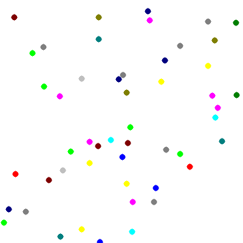
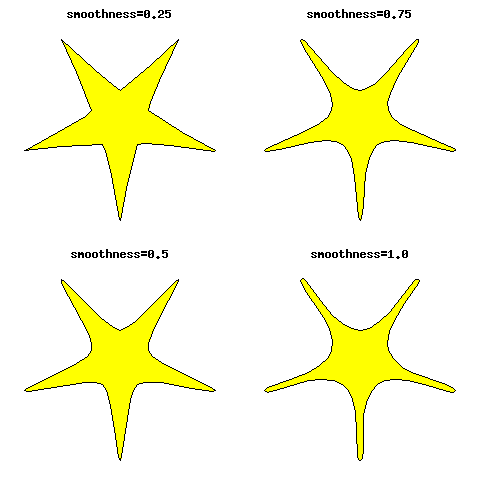

.. _sample_scripts:

Sample Scripts
==============

A good way to learn to use py_gd is to check out a few example scripts.

Ultra Simple Example
--------------------

About the simplest example for py_gd

This draws a red line at a diagonal across an image.

    

Animation Example
-----------------

This draws a bunch of dots in different colors
and makes an animated gif of them.

    

Example with Moderate Complexity
--------------------------------

py_gd demo with moderate complexity -- showing a number of the features

Can you tell what's being drawn from the code without looking at the results?

.. image:: examples/moderate_complex.png
    :align: center
    

Using a Color Ramp
------------------

Example of how to use a colorramp

In this case, we plot a "Heatmap" of a surface from the equation:

z = sin(x) + sin(y)

    

Drawing a Madelbrot set
-----------------------

Draws a Madelbrot by setting colors pixel by pixel

    

Smooth Polygon
--------------

This example draws a star with rounded points, with varying roundedness.

It uses a "Spline Polygon:

    