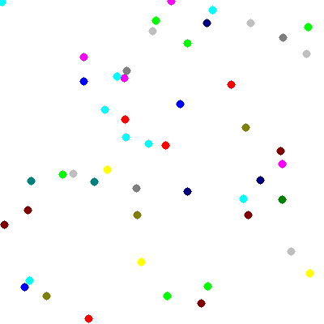

.. _tutorial_animation:

Animation Example
=================

Full script here: :download:`draw_dots.py <examples/draw_dots.py>`

This tutorial covers making a simple Animated GIF, as well as using color in a vectorized fashion with the ``draw_dots`` method.

Import the Libraries
--------------------

For this, the :class:Image and :class:ANimation are required. numpy is also used for moving the dots around randomly.::

    import numpy as np
    from py_gd import Image, Animation

Set up the Parameters and Create an ``Image``
---------------------------------------------

A few parameters for the animation -- feel free to play with those.

After creating the Image, it's cleared to set a white background (the default is transparent, which does not work with GIF)::

    N = 50 # number of dots
    w, h = 400, 400  # Size of image

    img = Image(width=400, height=400)
    img.clear('white')

Set Colors
----------

Assign random colors to the dots. ``get_colors()`` will return a list of all the colors set up on the image. The first few colors are transparent, white, black -- so random colors are chosen exclusing the first four, up the total number of colors. The deafult colorscheme is the 14 "standard html" colors. See :ref:`working_with_color` for more info. Initial position of the dots is set randomly::  

    # random colors: excluding first three: transparent, white, black
    num_colors = len(img.get_colors())
    colors = np.random.randint(3, num_colors - 1, N)

    # initial position of the points
    points = (np.random.random((N, 2)) * w).astype(np.int32)

Draw the Initial Image
----------------------

The dots are drawn in their itiial position for the first image of teh animation, and the image is saved as a PNG::

    # draw the initial image
    img.draw_dots(points, diameter=10, color=colors)

    #  Save the first frame as a PNG
    img.save('dots.png', 'png')

Create the Animation
--------------------

The :class:Animation is created, with some basic parameters: the filename, and the delay between frames, in 1/100 of a second. After creating, the animation is begun with the initial image. ::

    # create the animation
    anim = Animation('dots.gif',
                     delay=10,  # in 1/100s
                     )

    anim.begin(img)

Add Additional Frames
---------------------

A loop is run, making a new frame for each iteration. Each time, the dots are moved a random amount. The same image can be re-used -- clearing it each time, and then drawing the dots in their new position. Once the Image is created, it is added to the Animation.

Once complete, the Animation should be closed. ::

    # Run a loop to move the dots, and make a new frame each time
    for i in range(100):
        move = (np.random.random((N, 2)) * 20 - 10).astype(np.int32)
        points = points + move
        img.clear('white')
        img.draw_dots(points, diameter=10, color=colors)
        anim.add_frame(img)
    anim.close()

