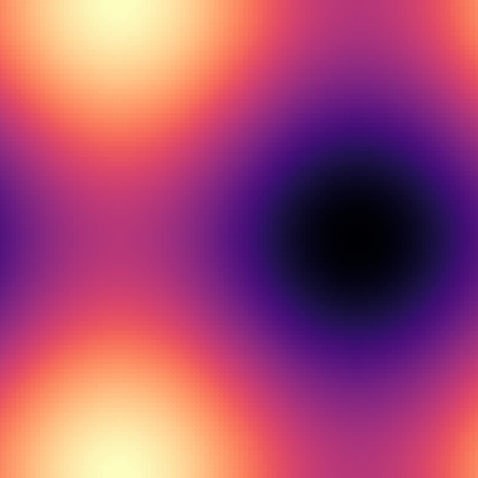

.. _tutorial_colorramp:

Using a ``ColorRamp``
=====================

Full script here:  :download:`colorramp.py <examples/colorramp.py>`

This tutorial covers rendering a "heat map" using a color ramp.

In this case, we plot a "heat map" of a surface from the equation:

z = sin(x) + sin(y)

Import the libraries
--------------------

For this one, you need ``numpy`` itself, the :class:`~py_gd.py_gd.Image` class, and the :class:`~py_gd.color_ramp.ColorRamp` class. Then set a few parameters for the image::

    import numpy as np
    from py_gd import Image
    from py_gd.color_ramp import ColorRamp

    N = 100  # number or grid points
    D = 9 # diameter of dots
    w, h = 600, 600  # Size of image

Compute the Function
--------------------

Some ``numpy`` magic is used here -- see the numpy docs for details, but in short, a square grid of values from 0 to 2 pi is set up, and the function:

z = sin(x) + sin(y)

Is computed, which results in a square array of values between -2.0 and 2.0::

    # Compute the function:

    span = np.linspace(0, 2 * np.pi, N)

    X, Y = np.meshgrid(span, span)

    Z = np.sin(X) + np.cos(Y)

Create the Image and Color Ramp:
--------------------------------

The image is created with the Black and White preset colorscheme. That will provide transparent, black, and white, for use for drawing text or something else.::

    img = Image(width=w, height=h, preset_colors='BW')

The colorramp is created with the "magma" colorscheme, included with ``py_gd``. The minimum and maximum expected values are set to what the function is expected to produce.

The base_colorsheme is set to the number of colors used in the image. Note: you could pass in 'BW' in this case, but this approach is more universal, in case any additional colors have been added to the image.::

    # create a ColorRamp:
    ramp = ColorRamp(colors='magma',  # use the magma colorscheme from MPL
                     min_value=-2.0,
                     max_value=2.0,
                     base_colorscheme=len(img.get_colors()),  # make sure we accommodate what's there
                     )

Once the colors have been set on the ``ColorRamp``, they need to be added to the ``Image``::

    # and the ramp colors to the image:
    img.add_colors(ramp.colorlist)

Draw the Image
--------------

The image will be drawn as overlapping dots. First you need to find the center points of the dots, corresponding to points where the function was computed. (more numpy magic here)::

    x = (X / np.pi / 2 * h).flat
    y = (Y / np.pi / 2 * w).flat

    points = np.c_[x, y]

The ``ColorRamp`` is used to get the color indices needed to draw the dots, and then they can be drawn::

    colors = ramp.get_color_indices(Z.flat)

    img.draw_dots(points, diameter=D, color=colors)

And the image is saved in the usual way:

    img.save('colorramp.png', 'png')

